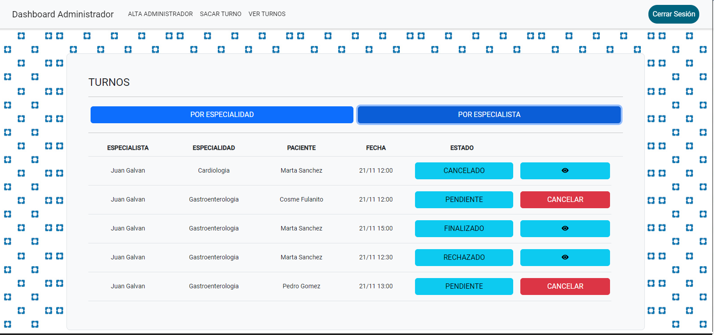
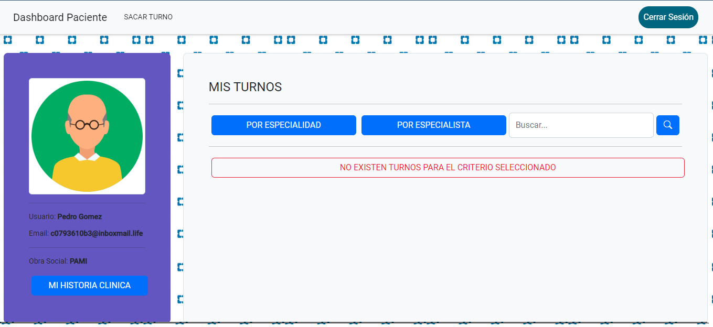
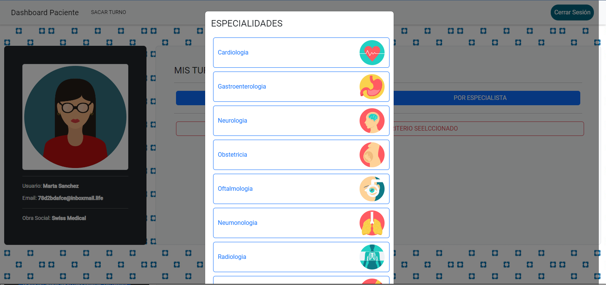
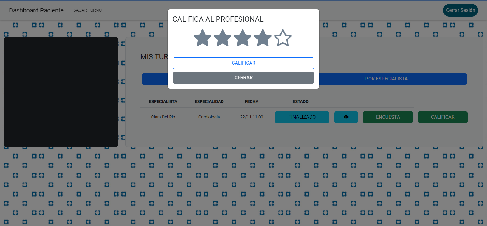

# TRABAJO PRACTICO FINAL - LABORATORIO 4

El siguiente Trabajo Practico plantea el desarrollo de una pagina para una clinica, la cual cuenta con secciones para Pacientes, Especialistas y Administradores. La misma permite el registro y administracion de usuarios y de turnos que involucren a los mismos. Esta desarrollada en Angular e implementada en Firebase para su version web.

## PANTALLAS

###### LOGIN:

El mismo cuenta con botones de acceso rapido para 3 pacientes, 2 especialistas y un Administrador. Y redireccion a la pantalla de registro si no se cuenta con usuario.

###### REGISTRO GENERAL:

Se puede elegir la opcion de registrarse como Profesional o Paciente. AL finalizar el registro todos los usuarios deben validar su mail para poder entrar al sistema y los usuarios con rol de profesional deberan ademas esperar a ser habilitados por un administrador

###### REGISTRO PACIENTE - PROFESIONAL:

Los mismos poseen validacion de los campos y CAPTCHA y posibilidad de subir fotos de perfil.

###### PANEL DE CONTROL ADMINISTRADOR:

Se ve el perfil del usuario y una lista con todos los usuarios de la plataforma con información de los mismos con la posibilidad de HABILITAR o INHABILITAR el ingreso a los usuarios con rol de PROFESIONAL.

###### REGISTRO ADMINISTRADORES:

Un administrador cuenta con la capacidad de dar de alta otros administradores

###### SACAR TURNO (ADMINISTRADOR):

Un administrador puede sacar turno a cualquier paciente eligiendo como la especialidad, especialista y paciente a cual sacarle dicho turno.

###### VER TURNOS (ADMINISTRADOR):

Un administrador puede ver los turnos de la clinica por especialidad o especialista. De los mismos puede ver los datos de dicho turno, el estado de los mismos. A su vez puede cancelar los turnos que todavia no fueron cancelados, rechazados o aceptados por pacientes/profesionales (dando un motivo de porque los cancela) y tambien puede ver el detalle de los turnos que ya si lo fueron.

###### USUARIOS (ADMINISTRADOR):

En esta seccion el administrador ve a todos los usuarios del sistema  y puede acceder a un pdf con la informacion de los turnos que tomo o dio cada uno presionando la imagen de perfil del usuario.

###### INFORMES (ADMINISTRADOR):

En esta seccion el administrador ve adistintos reportes sobre las estadisticas de uso del sistema y puede descargar los mismos. 

###### PANEL DE CONTROL (PROFESIONAL):

Un profesional aca puede administrar sus horarios de atencion y sus turnos. Del horario de atencion puede elegir el dia y en que franja horaria desea atender. De sus turnos, los mismos los puede filtrar por especialidades que tenga, pacientes que posean turnos con el o por un buscador de palabras clave. Y de los mismos puede realizar las siguientes acciones: rechazar o cancelar un turno (dando un motivo de porque los cancela), aceptarlos y finalizarlos (al finalizarlos debe dar un resumen del turno y el diagnostico del mismo) A su vez puede  ver el detalle de todas estas acciones descriptas anteriormente.

###### PACIENTES (PROFESIONAL):

Un profesional aca puede ver los pacientes que ya haya atendido y ver la historia clinica de los mismos y descargar la misma en PDF.

``

###### PANEL DE CONTROL (PACIENTE):

Un paciente aca puede ver su perfil y sus turnos ya sacados. Estos turnos los filtra o por especialidad o por especialista y de los mismos ve los datos del turno y puede elegir cancelarlo si aun no fue aceptado o cancelado/rechazado por el profesional/administrador. A su ves de los turnos que ya se resolvieron por alguno de los dos caminos puede ver el detalle de los mismos. Y ademas puede completar una encuesta y puntuar al profesional. Tambien puede ver su historia clinica filtrando por especialidad y descargar la misma en PDF.

``

``

###### SACAR TURNO (PACIENTE):

El paciente elige el turno que quiere basandose en la especialidad, profesional y horarios disponibles del mismo.

###### NAVEGACION:

Se cuenta con una pagina de error 404 para direcciones inexistentes y guards para prohibir el acceso a rutas que no correspondan a cada uno de los roles

## SPRINTS

Requerimientos por sprint y su estado

``

